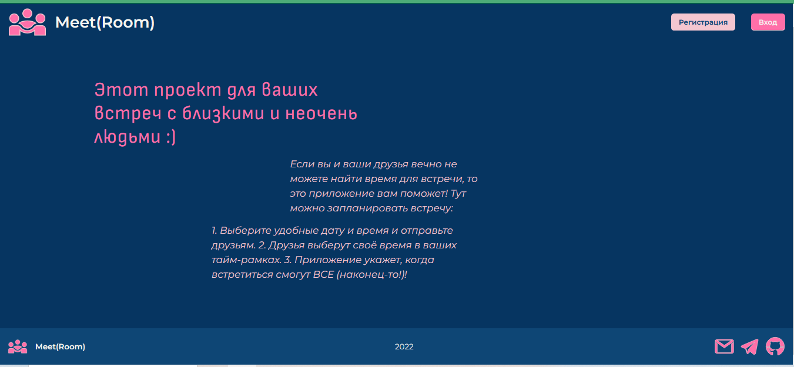
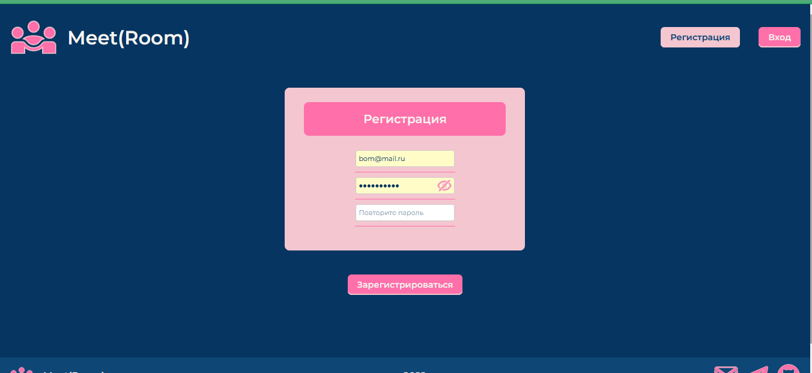
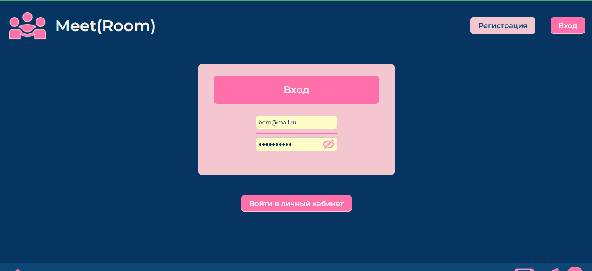
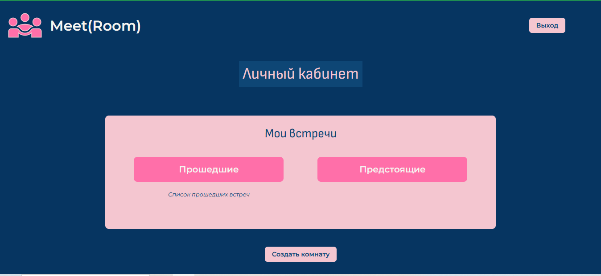
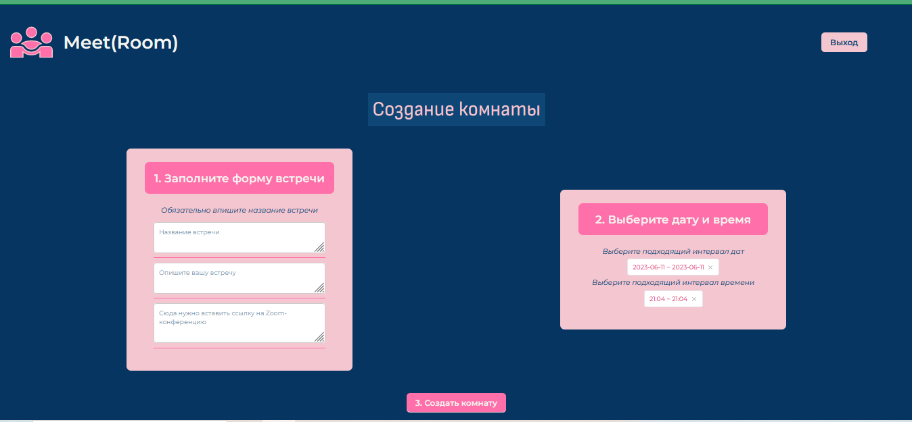
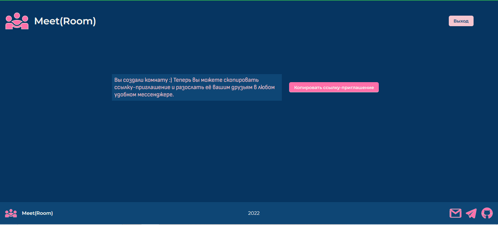

Десктопное приложение для планирования встреч между пользователями.

Проект на стадии разработки. Имеющийся стек: React (FC), Redux Toolkit, JavaScript, Less.

Реализация аутентификации и авторизации, запросы на сервер с помощью axios (REST API), использование React router dom, использование основных хуков (useState, useEffect) и др.

Авторы: Шпак Мария, Зыков Иван.

Прилагаю скриншоты приложения:

